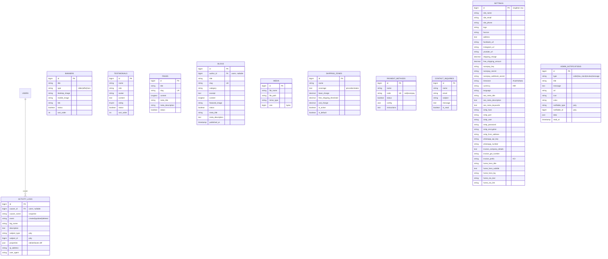
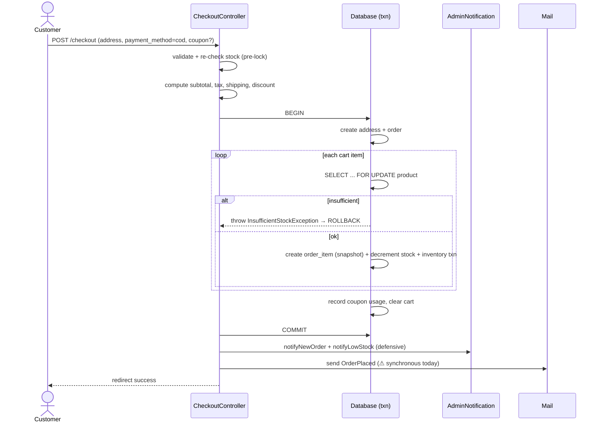
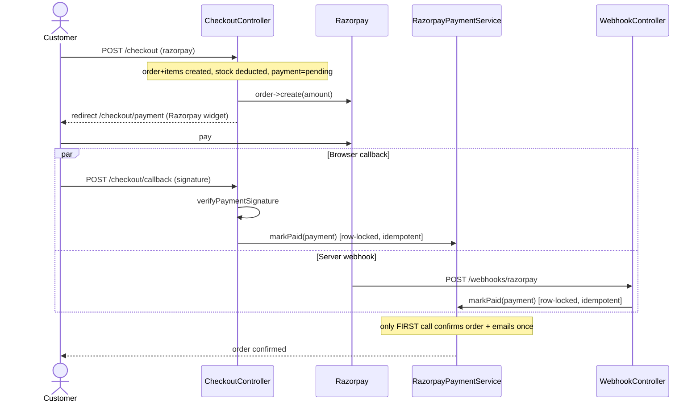

# KareOns — ER Diagram & Low-Level Design

> Herbal / Ayurvedic D2C e-commerce platform.
> Stack: **Laravel 12 · PHP 8.2 · Blade + Alpine.js + Tailwind (Vite) · MySQL/SQLite · Razorpay · DomPDF**
> This document is the authoritative design reference: full data model, module map, request lifecycles, and the design patterns in use.

---

## 1. System Overview

KareOns is a server-rendered monolith with two bounded surfaces sharing one database and auth layer:

| Surface | Namespace | Middleware | Purpose |
|---|---|---|---|
| **Storefront** | `App\Http\Controllers\Web` + root `PageController` | `web`, `auth` (for checkout/orders) | Catalog browsing, cart, checkout, payments, account |
| **Admin panel** | `App\Http\Controllers\Admin` | `web`, `auth`, `admin` | Catalog, orders, inventory, CMS, marketing, reports, settings |

Cross-cutting infrastructure: a **Settings singleton** (global config in DB), an **audit trail** (`LogsActivity` trait → `activity_logs`), **admin notifications**, **inventory ledger**, and a **payment reconciliation service** shared by the browser callback and the Razorpay webhook.

### 1.1 Layered architecture

```
┌──────────────────────────────────────────────────────────────┐
│  Presentation   Blade views · Alpine.js · Tailwind · Vite     │
├──────────────────────────────────────────────────────────────┤
│  HTTP           Routes → Controllers → Form Requests          │
│                 Middleware: admin, SecurityHeaders, throttle  │
├──────────────────────────────────────────────────────────────┤
│  Domain/Service ProductService · RazorpayPaymentService       │
│                 (checkout/pricing logic currently in-controller)│
├──────────────────────────────────────────────────────────────┤
│  Data Access    Repositories (Product) · Eloquent Models      │
├──────────────────────────────────────────────────────────────┤
│  Persistence    MySQL/SQLite · Cache · Queue (database)       │
├──────────────────────────────────────────────────────────────┤
│  External       Razorpay API · SMTP/Mail · DomPDF             │
└──────────────────────────────────────────────────────────────┘
```

---

## 2. Entity-Relationship Diagram

### 2.1 Core commerce domain

```mermaid
erDiagram
    USERS ||--o{ ADDRESSES : "has"
    USERS ||--o{ ORDERS : "places"
    USERS ||--o{ CART_ITEMS : "owns"
    USERS ||--o{ WISHLISTS : "saves"
    USERS ||--o{ REVIEWS : "writes"
    USERS ||--o{ COUPON_USAGES : "redeems"
    USERS ||--o{ RETURN_REQUESTS : "raises"
    USERS ||--o{ INVENTORY_TRANSACTIONS : "adjusts"
    USERS ||--o{ ACTIVITY_LOGS : "causes"
    USERS ||--o{ BLOGS : "authors"

    CATEGORIES ||--o{ CATEGORIES : "parent_of"
    CATEGORIES ||--o{ PRODUCTS : "classifies"
    BRANDS ||--o{ PRODUCTS : "brands"
    TAXES ||--o{ PRODUCTS : "taxed_by"

    PRODUCTS ||--o{ PRODUCT_IMAGES : "gallery"
    PRODUCTS ||--o{ CART_ITEMS : "in"
    PRODUCTS ||--o{ ORDER_ITEMS : "sold_as"
    PRODUCTS ||--o{ REVIEWS : "reviewed_in"
    PRODUCTS ||--o{ WISHLISTS : "wished_in"
    PRODUCTS ||--o{ INVENTORY_TRANSACTIONS : "stock_moves"

    ORDERS ||--o{ ORDER_ITEMS : "contains"
    ORDERS ||--|| PAYMENTS : "paid_by"
    ORDERS ||--o{ ORDER_TIMELINES : "history"
    ORDERS ||--o{ RETURN_REQUESTS : "returned_via"
    ORDERS ||--o{ COUPON_USAGES : "discounted_by"
    ADDRESSES ||--o{ ORDERS : "ships_to"

    COUPONS ||--o{ COUPON_USAGES : "used_in"

    USERS {
        bigint id PK
        string name
        string email UK
        string phone UK "nullable"
        timestamp email_verified_at
        string password
        enum role "admin|customer"
        boolean status
        string avatar
        timestamp last_login_at
        text notes
        int reward_points
        decimal wallet_balance
    }

    CATEGORIES {
        bigint id PK
        bigint parent_id FK "self, nullable"
        string name
        string slug UK
        text description
        string image
        string banner_image
        string meta_title
        text meta_description
        boolean status
        boolean show_on_homepage
        int sort_order
    }

    BRANDS {
        bigint id PK
        string name
        string slug UK
        text description
        string logo
        boolean status
    }

    TAXES {
        bigint id PK
        string name
        decimal rate "5,2"
        boolean status
    }

    PRODUCTS {
        bigint id PK
        bigint category_id FK
        bigint brand_id FK "nullable"
        bigint tax_id FK "nullable"
        string name
        string slug UK
        string sku UK
        text short_description
        longtext description
        string pack_size
        text benefits
        text ayurvedic_reference
        text suitable_for
        text disclaimer
        text ingredients
        text usage_instructions
        text storage_instructions
        text precautions
        decimal price "10,2"
        decimal sale_price "10,2 nullable"
        int stock_quantity
        decimal weight "8,2 nullable"
        string main_image
        boolean featured
        boolean status
        boolean is_featured
        boolean is_best_seller
        boolean is_trending
        string meta_title
        text meta_description
    }

    PRODUCT_IMAGES {
        bigint id PK
        bigint product_id FK
        string image_path
        int sort_order
    }

    ADDRESSES {
        bigint id PK
        bigint user_id FK "nullable (guest)"
        string full_name
        string phone
        string address_line_1
        string address_line_2
        string city
        string state
        string country
        string postal_code
        boolean is_default
    }

    CART_ITEMS {
        bigint id PK
        bigint user_id FK "nullable"
        string session_id "index, guest cart"
        bigint product_id FK
        int quantity
    }

    ORDERS {
        bigint id PK
        string order_number UK
        bigint user_id FK "nullable, setNull"
        bigint address_id FK "nullable, setNull"
        decimal subtotal
        decimal shipping_charge
        decimal discount_amount
        decimal tax_amount
        decimal grand_total
        string payment_method
        enum payment_status "pending|paid|failed|refunded"
        enum order_status "pending|confirmed|packed|shipped|delivered|returned|cancelled"
        string refund_status "none|pending|partial|refunded"
        text notes
    }

    ORDER_ITEMS {
        bigint id PK
        bigint order_id FK
        bigint product_id FK "nullable, setNull"
        string product_name "snapshot"
        string sku "snapshot"
        decimal price "snapshot"
        int quantity
        decimal total
    }

    PAYMENTS {
        bigint id PK
        bigint order_id FK
        string razorpay_order_id
        string razorpay_payment_id
        string transaction_id
        decimal amount
        string currency "INR"
        enum status "pending|success|failed|refunded"
        timestamp paid_at
    }

    ORDER_TIMELINES {
        bigint id PK
        bigint order_id FK
        string status
        text notes
    }

    RETURN_REQUESTS {
        bigint id PK
        bigint order_id FK
        bigint user_id FK
        enum type "refund|replacement"
        string reason
        text customer_note
        text admin_note
        enum status "pending|approved|rejected|completed"
    }

    REVIEWS {
        bigint id PK
        bigint user_id FK
        bigint product_id FK
        tinyint rating
        string title
        text review
        json images
        boolean status
        boolean is_verified_purchase
        text admin_reply
    }

    WISHLISTS {
        bigint id PK
        bigint user_id FK
        bigint product_id FK
    }

    COUPONS {
        bigint id PK
        string code UK
        enum type "percentage|fixed"
        decimal value
        decimal minimum_order_amount
        int usage_limit "nullable"
        int used_count
        timestamp starts_at
        timestamp expires_at
        boolean status
    }

    COUPON_USAGES {
        bigint id PK
        bigint coupon_id FK
        bigint user_id FK "nullable"
        bigint order_id FK "nullable"
    }

    INVENTORY_TRANSACTIONS {
        bigint id PK
        bigint product_id FK
        bigint user_id FK "nullable, admin"
        string type "purchase|adjustment|order_fulfillment|order_cancellation|return"
        int quantity "signed +in/-out"
        text notes
        string reference_id "order_number/PO"
    }
```



### 2.2 CMS, marketing & platform domain



### 2.3 Framework/support tables
`sessions`, `password_reset_tokens`, `cache` + `cache_locks`, `jobs` + `job_batches` + `failed_jobs`. Standard Laravel; `sessions` and `jobs` are DB-backed per `.env` defaults.

### 2.4 Relationship cardinality summary

| Parent | Child | Type | On delete | Notes |
|---|---|---|---|---|
| categories | categories | 1:N self | `nullOnDelete` | parent/child tree (2-level in UI) |
| categories | products | 1:N | cascade | |
| brands | products | 1:N | `nullOnDelete` | optional |
| taxes | products | 1:N | `nullOnDelete` | per-product GST rate |
| products | product_images | 1:N | cascade | gallery |
| products | order_items | 1:N | `setNull` | **item snapshots price/name/sku** so history survives product deletion |
| orders | order_items | 1:N | cascade | |
| orders | payments | 1:1 | cascade | one payment row per order |
| orders | order_timelines | 1:N | cascade | status audit |
| orders | return_requests | 1:N | cascade | |
| users | orders | 1:N | `setNull` | guest orders keep `user_id=null` |
| coupons | coupon_usages | 1:N | cascade | + `used_count` counter on coupon |
| users+products | wishlists | M:N via wishlists | cascade | `unique(user,product)` |
| users+products | reviews | M:N via reviews | cascade | `unique(user,product)` — one review each |
| products | inventory_transactions | 1:N | cascade | append-only stock ledger |

---

## 3. Domain Model — invariants & business rules

### 3.1 Product & pricing
- **Effective price** = `sale_price ?? price` (`Product::getEffectivePriceAttribute`).
- Booleans cast explicitly (`status`, `is_featured`, `is_best_seller`, `is_trending`) — required for Blade badge comparisons.
- `reviews()` relation is **pre-filtered to `status = true`** (approved only). Admin moderates via `admin_reply` + `status`.
- Saving/deleting a product **busts the `homepage_data` cache** (model `booted()` hooks).

### 3.2 Cart
- Dual-keyed: `user_id` (auth) or `session_id` (guest). ⚠️ *Current checkout reads by `Auth::id()` only — see §7 risks.*

### 3.3 Order lifecycle (state machine)
```
pending → confirmed → packed → shipped → delivered
   │                                        │
   ├──────────── cancelled ─────────────────┤
   └──────────── returned ←── delivered ─────┘
payment_status: pending → paid | failed | refunded
refund_status:  none → pending → partial | refunded
```
- `order_number` = `KO-` + random 8, uniqueness-checked in a loop.
- **Order items are immutable snapshots** (`product_name`, `sku`, `price`) — deleting/renaming a product never rewrites order history.
- Every status change should append an `order_timelines` row (audit).

### 3.4 Inventory (critical correctness path)
- Stock is deducted **at order creation**, not at payment.
- Deduction runs inside a `DB::transaction` with `lockForUpdate()` on the product row + re-check → closes the check-then-decrement race (two buyers, last unit).
- Every movement writes an `inventory_transactions` row (signed qty). Types: `purchase`, `adjustment`, `order_fulfillment`, `order_cancellation`, `return`.
- Because stock is pre-deducted, a **failed/abandoned Razorpay payment must restock** (`RazorpayPaymentService::markFailed`) or stock leaks.

### 3.5 Coupons
Validated on: active flag, `starts_at`/`expires_at` window, global `usage_limit` vs `used_count`, `minimum_order_amount`, and **per-user single use** (`coupon_usages`). Discount = `percentage` (of subtotal) or `fixed` (capped at subtotal).

### 3.6 Payments (idempotency contract)
`RazorpayPaymentService` is the single source of truth, invoked by **both** the browser callback and the server webhook:
- `markPaid()` — row-locked, idempotent; only the first success confirms the order + sends `OrderPlaced` once; never moves a shipped/delivered order backwards.
- `markFailed()` — row-locked, idempotent; restocks + cancels; never downgrades a success/refund.

### 3.7 Settings singleton
One row, accessed via `setting('key', default)` helper (`app/Helpers/SettingsHelper.php`, autoloaded). Holds store identity, shipping thresholds, payment keys, SMTP, WhatsApp, invoice/GST, SEO, homepage hero.

### 3.8 Audit & notifications
- `LogsActivity` trait auto-records create/update/delete to `activity_logs`, **admin actions only** by default (skips customer-side writes), capturing old/new diffs and ignoring noisy columns.
- `AdminNotification::notifyNewOrder()` / `notifyLowStock()` fire post-checkout, wrapped defensively so they can never break checkout.

---

## 4. Module / Class Map (Low-Level Design)

### 4.1 Storefront controllers (`Web\`)
| Controller | Key responsibilities |
|---|---|
| `HomeController` | Homepage: banners, featured/best-seller/trending, categories, testimonials; caches `homepage_data` |
| `ShopController` | Catalog listing: filter (category/brand/price), sort, paginate |
| `ProductController` | PDP: product + gallery + approved reviews + related |
| `CartController` | add/update/remove (user or session keyed) |
| `CouponController` | AJAX apply/remove, throttled |
| `CheckoutController` | index/store/payment/callback/success — **fat controller, holds pricing+order logic** |
| `RazorpayWebhookController` | server-to-server, CSRF-exempt, delegates to `RazorpayPaymentService` |
| `OrderController` | customer order history/detail |
| `ReturnRequestController` | raise refund/replacement |
| `WishlistController` | toggle/list |
| `AddressController` | resource CRUD |
| `ReviewController` | submit review (auth + throttled) |
| `BlogController`, `SitemapController` | content + SEO |

### 4.2 Admin controllers (`Admin\`)
Dashboard · Product · Category · Brand · Tax · Order (+invoice/packing-slip/shipping-label PDFs) · Inventory (history + adjustment) · Coupon · Banner · Testimonial · Page · Media · ShippingZone · PaymentMethod · ReturnRequest · Customer · Review · Blog · ContactInquiry (+reply) · Notification (feed/read/clear) · ActivityLog · Report (sales/customer/coupon/inventory/profit/tax/order tabs) · Setting (tabbed).

### 4.3 Domain services & data access
| Class | Role | Pattern |
|---|---|---|
| `App\Services\ProductService` | product query/orchestration | Service |
| `App\Services\RazorpayPaymentService` | payment state transitions, idempotent | Service / State transition |
| `App\Repositories\ProductRepository` + `Interfaces\ProductRepositoryInterface` | product data access, bound in `RepositoryServiceProvider` | Repository + DI |
| `App\Support\LogsActivity` (trait) | drop-in model audit | Observer (Eloquent events) |
| `App\Helpers\SettingsHelper` (`setting()`) | global config accessor | Service Locator |
| `App\Exceptions\InsufficientStockException` | typed control flow for stock rollback | — |
| `App\Console\Commands\ExpireStalePayments` | cancel/restock stale pending payments | Scheduled command |
| `App\Http\Middleware\AdminMiddleware` | role gate | Middleware |
| `App\Http\Middleware\SecurityHeaders` | CSP/security headers | Middleware |
| `App\Mail\OrderPlaced/OrderShipped/InquiryReply` | transactional email | Mailable |

### 4.4 Design patterns present
MVC · Repository + Interface DI · Service layer · Eloquent Observer (traits/hooks) · Service Locator (settings) · Middleware chain · Snapshot (order items) · Idempotent state transition (payments) · Ledger/event-sourcing-lite (inventory & activity logs) · Polymorphic association (activity_logs, admin_notifications).

---

## 5. Key Request Lifecycles (sequence)

### 5.1 Checkout — COD


### 5.2 Checkout — Razorpay + webhook reconciliation


### 5.3 Failed/abandoned payment restock
`ExpireStalePayments` (scheduled) **or** failed callback/webhook → `markFailed()` → row-lock → restock each line + `inventory_transactions(order_cancellation)` → `order_status=cancelled`, `payment_status=failed`. Idempotent.

---

## 6. Non-functional design

| Concern | Current implementation |
|---|---|
| **Concurrency** | `lockForUpdate` on product & payment rows; DB transactions wrap order creation |
| **Idempotency** | Payment transitions safe under duplicate callback+webhook |
| **Caching** | `homepage_data` cache, busted on product save/delete |
| **Rate limiting** | `throttle:coupon`, `throttle:reviews` named limiters |
| **Security** | `AdminMiddleware` role gate, `SecurityHeaders`, CSRF (webhook exempt), signature verification, hashed passwords, `robots.txt` disallows private paths |
| **SEO** | slugs, meta fields per entity, dynamic `sitemap.xml` + `robots.txt`, CMS pages |
| **Auditability** | `activity_logs` (admin diffs), `order_timelines`, `inventory_transactions`, `admin_notifications` |
| **Documents** | DomPDF invoice / packing slip / shipping label |
| **Async** | Queue configured (`database`) but **transactional mail sent synchronously** today |

---

## 7. Known risks / design debt (to resolve before/at scale)

1. **No guest checkout (by design) + misleading dead code** — checkout routes are behind `auth`, so guests are redirected to login before `CheckoutController` runs; the session cart is correctly migrated on login/registration (session ID captured pre-regeneration, quantities de-duplicated). Therefore `getCartItems()` filtering by `Auth::id()` is *correct*, but the controller's "null for guests" handling/comments are **dead & misleading** — remove them, or enable true guest checkout (drop the `auth` guard + email capture) as a conversion feature. Minor: login cart-merge doesn't cap merged quantity to the per-item/stock limit; orphaned guest carts (`session_id`) are never pruned.
2. **Synchronous transactional email** — `OrderPlaced` sent inline in checkout; move mailables to `ShouldQueue` + run a queue worker.
3. **Duplicated pricing math** — subtotal/tax/shipping computed in both `CheckoutController::index()` and `store()`; extract a `CartCalculator`/`PricingService`, and order creation into an `OrderService`.
4. **Inline validation** — checkout validates in-controller; move to a `PlaceOrderRequest` Form Request for consistency with the Auth module.
5. **Dead/duplicate controllers** — both root `BlogController` and `Web\BlogController` (and a root `PageController`); consolidate into `Web\`.
6. **No reusable storefront Blade components** — only Breeze base components exist; extract `<x-product-card>`, `<x-price>`, `<x-rating-stars>`, `<x-quantity-selector>`.
7. **Test coverage** — only default Breeze auth tests; the money paths (checkout, coupon, inventory race, payment reconciliation) are untested.
8. **`.env` production hardening** — defaults ship `APP_DEBUG=true`, SQLite, `MAIL_MAILER=log`; needs MySQL/Redis + real SMTP + `APP_DEBUG=false`.

---

## 8. Table inventory (quick index)

**Commerce:** users, addresses, categories, brands, taxes, products, product_images, cart_items, orders, order_items, payments, order_timelines, return_requests, reviews, wishlists, coupons, coupon_usages, inventory_transactions
**CMS/Marketing:** banners, testimonials, pages, blogs, media, contact_inquiries
**Config/Platform:** settings, shipping_zones, payment_methods, admin_notifications, activity_logs
**Framework:** sessions, password_reset_tokens, cache, cache_locks, jobs, job_batches, failed_jobs
